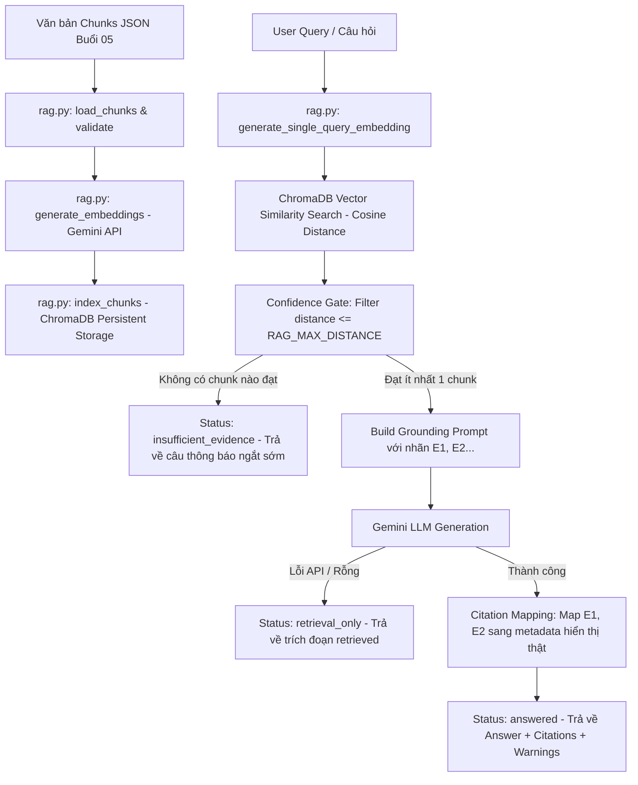

# 📚 RAG FOUNDATION - BUỔI 07
## Hệ thống RAG Nâng cao: Semantic Indexing, Distance Confidence Gate & Grounded Citation Mapping

---

## 1. 🎯 Mục tiêu
Dự án Buổi 07 xây dựng một hệ thống RAG (Retrieval-Augmented Generation) hoàn chỉnh, có kiểm chứng nguồn gốc (Grounded Evidence) và dẫn nguồn tự động (Citation Mapping) dựa trên tập tài liệu văn bản quy phạm pháp luật của Ngân hàng Nhà nước Việt Nam (NHNN).

**Các nguyên tắc kỹ thuật bắt buộc:**
- **Evidence kiểm chứng được:** Câu trả lời của LLM phải được trích dẫn trực tiếp từ các trích đoạn văn bản có sẵn.
- **Nguồn trích dẫn thật:** Trích dẫn (`[Nguồn: ..., tr. N-M, chunk: ...]`) được lấy chính xác từ metadata thật của tài liệu, không tin tưởng trích dẫn tự sinh của LLM.
- **Không tạo vector giả:** Không dùng zero vector, random vector hay hash vector khi thiếu API Key hoặc lỗi embedding.
- **Confidence Gate:** Tự động loại bỏ các trích đoạn không đạt ngưỡng khoảng cách ngữ nghĩa (`RAG_MAX_DISTANCE`). Nếu không có bằng chứng đạt yêu cầu, ngắt sớm và thông báo không đủ thông tin mà **không** gọi API Gemini Generation.
- **Kiểm thử tự động Offline:** Bộ unit test 100% không phụ thuộc Internet hay Gemini API thật.

---

## 2. 🔗 Quan hệ với Buổi 05 và Buổi 06
- **Buổi 05 (Data Chunking & Preprocessing):** Cung cấp dữ liệu thô đã được phân đoạn theo các chiến lược (`hierarchical`, `semantic`, `fixed-size`) lưu tại `rag_foundation/buoi_05/output/chunks/`.
- **Buổi 06 (Vector Database & Semantic Search Basis):** Cung cấp các thử nghiệm nền tảng về ChromaDB và Gemini Embeddings.
- **Buổi 07 (Advanced Production RAG Pipeline):** Đóng gói toàn bộ loader, ChromaDB persistent storage, Gemini Embeddings, Confidence Gate, Grounded Answer Generation, Citation Mapping, CLI tool, Streamlit UI và bộ Unit Test tự động vào một ứng dụng hoàn chỉnh.

---

## 3. 🏗️ Sơ đồ Pipeline



---

## 4. 📁 Cấu trúc Thư mục Buổi 07

```text
rag_foundation/buoi_07/
├── SPEC_buoi_07.md             # Agent Specification & Chi tiết Yêu cầu Nghiệp vụ
├── buoi_07.md                  # Hướng dẫn chi tiết bài học Buổi 07
├── rag.py                      # Core Module RAG (Loader, Embedding, Indexing, Retrieval, Gate, Citation)
├── app.py                      # Giao diện Web UI bằng Streamlit
├── requirements.txt            # Thư viện phụ thuộc (streamlit, google-genai, chromadb, python-dotenv)
├── .env.example                # File cấu hình mẫu
├── .env                        # File cấu hình môi trường thực tế (GitIgnored)
├── .gitignore                  # Cấu hình bỏ qua các file nhạy cảm và storage
├── README.md                   # Tài liệu hướng dẫn sử dụng và nghiệm thu
├── tests/                      # Bộ kiểm thử tự động (Offline Unit Tests)
│   ├── __init__.py
│   ├── test_loader.py          # Unit test cho Data Loader & Validator
│   ├── test_indexing.py        # Unit test cho Embedding Validation & ChromaDB Indexing
│   ├── test_query.py           # Unit test cho Retrieval, Confidence Gate & Citation Mapping
│   └── fixtures/
│       └── chunks_sample.json  # Dữ liệu mẫu 5 chunks phục vụ testing
└── storage/
    ├── .gitkeep
    └── chroma/                 # ChromaDB Persistent Storage Local (GitIgnored)
```

---

## 5. 🛠️ Điều kiện Đầu vào
- **Hệ điều hành:** Windows, Linux, hoặc macOS.
- **Python Environment:** Đã cài đặt môi trường virtual environment của Buổi 05 (`rag_foundation/buoi_05/.venv`).
- **Dữ liệu nguồn:** Các file JSON chứa trích đoạn văn bản trong `rag_foundation/buoi_05/output/chunks/`.
- **Google Gemini API Key:** Cần có API Key hợp lệ để thực hiện indexing và generation thực tế trên runtime.

---

## 6. 🐍 Cách dùng Python Interpreter Buổi 05

Luôn sử dụng đúng Python Interpreter của Buổi 05 để đảm bảo môi trường thống nhất:

- **Windows PowerShell:**
  ```powershell
  rag_foundation/buoi_05/.venv/Scripts/python.exe
  ```

- **Linux / macOS:**
  ```bash
  rag_foundation/buoi_05/.venv/bin/python
  ```

---

## 7. 📦 Cách Cài đặt Requirements

Kích hoạt hoặc sử dụng trực tiếp Python Interpreter Buổi 05 để cài đặt dependencies:

- **Windows:**
  ```powershell
  rag_foundation/buoi_05/.venv/Scripts/python.exe -m pip install -r rag_foundation/buoi_07/requirements.txt
  ```

- **Linux / macOS:**
  ```bash
  rag_foundation/buoi_05/.venv/bin/python -m pip install -r rag_foundation/buoi_07/requirements.txt
  ```

---

## 8. ⚙️ Tạo File `.env` từ `.env.example`

Tạo file `.env` bằng cách sao chép từ `.env.example`:

- **Windows PowerShell:**
  ```powershell
  Copy-Item rag_foundation/buoi_07/.env.example rag_foundation/buoi_07/.env
  ```

- **Linux / macOS:**
  ```bash
  cp rag_foundation/buoi_07/.env.example rag_foundation/buoi_07/.env
  ```

---

## 9. 📝 Giải thích các Biến Môi trường trong `.env`

| Biến môi trường | Ý nghĩa | Giá trị mặc định / Khuyến nghị |
|---|---|---|
| `GEMINI_API_KEY` | API Key cá nhân từ Google AI Studio | `AQ...` (Điền key thật của bạn) |
| `GEMINI_EMBEDDING_MODEL` | Tên mô hình tạo vector embedding | `gemini-embedding-2` |
| `GEMINI_EMBEDDING_DIM` | Kích thước chiều của vector | `768` (từ 128 đến 3072) |
| `GEMINI_GENERATION_MODEL` | Tên mô hình sinh câu trả lời LLM | `gemini-3.5-flash-lite` |
| `DEFAULT_TOP_K` | Số lượng trích đoạn truy xuất mặc định | `5` (từ 1 đến 20) |
| `RAG_MAX_DISTANCE` | Ngưỡng khoảng cách Cosine tối đa | `0.45` (float >= 0.0) |

---

## 10. 🧪 Lệnh Validate Dữ liệu Chunks JSON

Kiểm tra tính hợp lệ của các tập chunks JSON Buổi 05 mà không gọi API hay sửa storage:

```powershell
# Windows
rag_foundation/buoi_05/.venv/Scripts/python.exe rag_foundation/buoi_07/rag.py validate --strategy hierarchical

# Linux/macOS
rag_foundation/buoi_05/.venv/bin/python rag_foundation/buoi_07/rag.py validate --strategy hierarchical
```

---

## 11. 📊 Lệnh Xem Trạng thái System & ChromaDB

Kiểm tra thông số cấu hình và số lượng record hiện có trong ChromaDB (thao tác read-only):

```powershell
# Windows
rag_foundation/buoi_05/.venv/Scripts/python.exe rag_foundation/buoi_07/rag.py status --strategy hierarchical

# Linux/macOS
rag_foundation/buoi_05/.venv/bin/python rag_foundation/buoi_07/rag.py status --strategy hierarchical
```

---

## 12. 🚀 Lệnh Index Dữ liệu vào ChromaDB

Tạo Gemini Embeddings và đánh chỉ mục persistent vào ChromaDB:

```powershell
# Windows
rag_foundation/buoi_05/.venv/Scripts/python.exe rag_foundation/buoi_07/rag.py index --strategy hierarchical

# Linux/macOS
rag_foundation/buoi_05/.venv/bin/python rag_foundation/buoi_07/rag.py index --strategy hierarchical
```

---

## 13. 🔄 Lệnh Reset Collection cũ trước khi Index

Xóa collection cũ thuộc đúng strategy/dimension hiện tại và index lại từ đầu:

```powershell
# Windows
rag_foundation/buoi_05/.venv/Scripts/python.exe rag_foundation/buoi_07/rag.py index --strategy hierarchical --reset

# Linux/macOS
rag_foundation/buoi_05/.venv/bin/python rag_foundation/buoi_07/rag.py index --strategy hierarchical --reset
```

---

## 14. 🔍 Lệnh Truy vấn Hỏi đáp qua CLI

Đặt câu hỏi tra cứu văn bản trực tiếp từ dòng lệnh:

```powershell
# Windows
rag_foundation/buoi_05/.venv/Scripts/python.exe rag_foundation/buoi_07/rag.py query --strategy hierarchical --top_k 5 --question "Quy định về việc cơ cấu lại thời hạn trả nợ?"

# Linux/macOS
rag_foundation/buoi_05/.venv/bin/python rag_foundation/buoi_07/rag.py query --strategy hierarchical --top_k 5 --question "Quy định về việc cơ cấu lại thời hạn trả nợ?"
```

---

## 15. 🧪 Lệnh Chạy Bộ Kiểm thử Tự động (Unit Tests)

Khởi chạy toàn bộ 34 unit tests hoàn toàn offline:

```powershell
# Windows
rag_foundation/buoi_05/.venv/Scripts/python.exe -m unittest discover -s rag_foundation/buoi_07/tests -v

# Linux/macOS
rag_foundation/buoi_05/.venv/bin/python -m unittest discover -s rag_foundation/buoi_07/tests -v
```

---

## 16. 🌐 Lệnh Khởi chạy Giao diện Streamlit UI

Mở giao diện web tương tác trực quan:

```powershell
# Windows
rag_foundation/buoi_05/.venv/Scripts/python.exe -m streamlit run rag_foundation/buoi_07/app.py

# Linux/macOS
rag_foundation/buoi_05/.venv/bin/python -m streamlit run rag_foundation/buoi_07/app.py
```

---

## 17. 💡 Giải thích các Khái niệm Kỹ thuật

- **Strategy (`hierarchical`, `semantic`, `fixed-size`):** Phương pháp phân đoạn văn bản ở Buổi 05. Mỗi strategy sẽ có tập chunks và collection ChromaDB riêng biệt.
- **Embedding Model & Dimension:** Mô hình biểu diễn văn bản dưới dạng vector toán học. Chiều vector (ví dụ 768) quyết định độ chi tiết của không gian ngữ nghĩa.
- **Collection Identity:** Tên collection ChromaDB được sinh duy nhất: `nhnn-<strategy>-<dimension>-<model_hash>`. Việc thay đổi strategy, model hoặc dimension sẽ tự động trỏ sang collection khác.
- **Top-K:** Số lượng trích đoạn có độ tương đồng cao nhất được chọn ra từ Vector Database.
- **Cosine Distance:** Khoảng cách giữa 2 vector trên mặt cầu đơn vị. Giá trị càng gần `0.0` nghĩa là độ tương đồng ngữ nghĩa càng cao.
- **RAG_MAX_DISTANCE:** Ngưỡng khoảng cách tối đa cho phép. Các trích đoạn có `distance > RAG_MAX_DISTANCE` sẽ bị chặn bởi Confidence Gate.
- **Confidence Gate:** Cơ chế ngắt sớm (Early Stopping). Nếu không có trích đoạn nào có `distance <= RAG_MAX_DISTANCE`, hệ thống lập tức ngắt pipeline và trả về status `insufficient_evidence` mà không gọi Gemini LLM.
- **Retrieval-Only:** Trạng thái fallback khi đã tìm thấy các trích đoạn liên quan nhưng quá trình sinh câu trả lời với LLM gặp sự cố (lỗi mạng, hết quota, hoặc rỗng).
- **Citation Mapping:** Quy trình hậu xử lý kiểm soát chất lượng. Thay thế các nhãn tạm `[E1]`, `[E2]` do LLM sinh ra bằng thông tin trích dẫn metadata chuẩn xác `[Nguồn: <source>, tr. N-M, chunk: <chunk_id>]`.

---

## 18. 🛑 Cách Dừng Tiến trình Streamlit

Để dừng tiến trình ứng dụng Streamlit đang chạy tại cửa sổ Terminal, hãy nhấn tổ hợp phím **`Ctrl + C`**.

---

## 19. 🛠️ Hướng dẫn Khắc phục Lỗi (Troubleshooting)

| Sự cố | Nguyên nhân | Cách xử lý |
|---|---|---|
| `ModuleNotFoundError` | Thiếu thư viện trong môi trường | Chạy lại lệnh cài đặt requirements bằng đúng interpreter Buổi 05. |
| `Thiếu GEMINI_API_KEY` | File `.env` chưa có key | Copy `.env.example` thành `.env` và điền key thật của bạn. |
| `Collection ... chưa tồn tại` | Chưa chạy lệnh index | Chạy lệnh `rag.py index --strategy <strategy>` để đánh chỉ mục trước. |
| `Mismatch collection metadata` | Đổi cấu hình model/dim mà chưa reset | Chạy lệnh `rag.py index --strategy <strategy> --reset`. |
| `429 RESOURCE_EXHAUSTED` | Chạm hạn mức Rate Limit API | Hệ thống đã có sẵn tự động retry backoff ($2s \to 4s \to 8s$), hoặc bạn chờ 1 phút trước khi index lại. |

---

## 20. ⚠️ Giới hạn của Demo
- Ứng dụng tập trung vào tính chính xác của tra cứu tài liệu quy phạm pháp luật NHNN, chưa hỗ trợ đọc file scan (cần OCR).
- Hệ thống thực hiện Vector Similarity Search trực tiếp, chưa kết hợp BM25 Keyword Search (Hybrid Search) hay Reranker.

---

## 21. 🛡️ Cảnh báo Bảo mật & Pháp lý

- **Cảnh báo Pháp lý:** Câu trả lời sinh ra từ hệ thống RAG chỉ nhằm mục đích tham khảo tra cứu tài liệu, **KHÔNG COI LÀ TƯ VẤN PHÁP LÝ CHÍNH THỨC**.
- **Hiệu chỉnh Threshold:** Ngưỡng `RAG_MAX_DISTANCE` cần được hiệu chỉnh thực nghiệm tùy thuộc vào độ dài văn bản và đặc thù của tập dữ liệu.
- **Bảo mật Dữ liệu:** Nội dung của các trích đoạn sẽ được gửi tới API của Google Gemini để tạo embedding và sinh câu trả lời. Người vận hành chỉ sử dụng dữ liệu được phép gửi tới dịch vụ đám mây bên ngoài.

---

## 📋 KẾ HOẠCH KIỂM THỬ THỦ CÔNG (MANUAL TEST PLAN)

Dưới đây là 3 câu hỏi thử nghiệm nghiệm thu hệ thống trên tập dữ liệu thật:

### 🔹 Câu hỏi A (Có khả năng thuộc tài liệu):
> `"Cơ cấu lại thời hạn trả nợ được quy định như thế nào?"`
- **Kỳ vọng:** Truy xuất các trích đoạn từ Thông tư 02/2023/TT-NHNN hoặc Thông tư 03/2021/TT-NHNN, trả về câu trả lời kèm trích dẫn metadata chuẩn.

### 🔹 Câu hỏi B (Có khả năng thuộc tài liệu):
> `"Việc phân loại nợ và trích lập dự phòng được thực hiện như thế nào?"`
- **Kỳ vọng:** Truy xuất trích đoạn quy định phân loại nợ và trích lập dự phòng rủi ro, hiển thị trích dẫn trang và `chunk_id` tương ứng.

### 🔹 Câu hỏi C (Ngoài phạm vi tài liệu):
> `"Ngân hàng nào có lãi suất tiết kiệm cao nhất hôm nay?"`
- **Kỳ vọng nghiệm thu:**
  - Vì tập dữ liệu quy phạm pháp luật không chứa thông tin lãi suất hôm nay, các trích đoạn truy xuất sẽ có `distance > RAG_MAX_DISTANCE`.
  - Confidence Gate sẽ chặn không cho gọi Gemini Generation API.
  - Hệ thống trả về trạng thái `insufficient_evidence` với câu trả lời: `"Không tìm thấy đủ thông tin liên quan trong tài liệu đã cung cấp."`
  - **Lưu ý:** Không bịa đặt tên ngân hàng hay con số lãi suất. (Nếu C vẫn vượt qua threshold, ghi nhận là false positive của retrieval/gate và tiếp tục hiệu chỉnh threshold).
