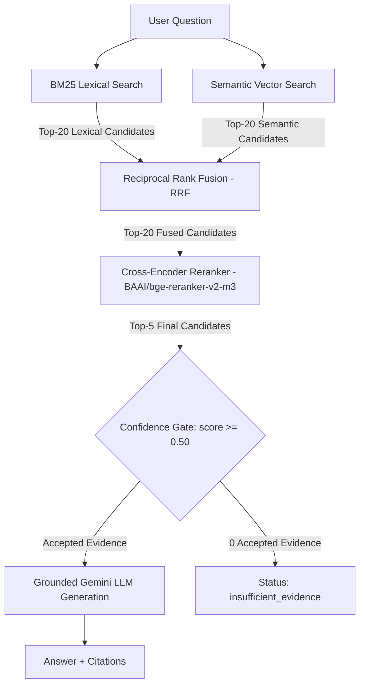

# ⚡ Project Advanced RAG - Buổi 08: Lexical Search, Fusion & Reranking

Hệ thống RAG nâng cao 5 tầng (Multi-Stage Pipeline) xử lý tài liệu pháp lý tiếng Việt (Thông tư NHNN), nâng cấp vượt trội so với Semantic Baseline Buổi 07.

---

## 🎯 1. Mục tiêu và Khác biệt Buổi 07 vs Buổi 08

| Đặc điểm | Semantic Baseline (Buổi 07) | Advanced RAG (Buổi 08) |
|---|---|---|
| **Phương pháp Truy xuất** | Chỉ dựa vào Semantic Vector Search | Kết hợp **BM25 Lexical** + **Gemini Semantic Vector** |
| **Hợp nhất Danh sách** | Không có | **Reciprocal Rank Fusion (RRF)** rank-based fusion |
| **Tái xếp hạng (Reranking)**| Không có | **Cross-Encoder Reranker** (`BAAI/bge-reranker-v2-m3`) |
| **Gating Confidence** | Cosine Distance Gate (`<= 0.45`) | Rerank Sigmoided Score Gate (`>= 0.50`) |
| **Giao diện Web** | Single-stage Q&A form | **Multi-stage 4-Tab Streamlit Dashboard** |

---

## 🏗️ 2. Sơ đồ Kiến trúc Pipeline 5 Tầng



---

## 📁 3. Cấu trúc Project Buổi 08

```text
rag_advanced/buoi_08/
├── SPEC_buoi_08.md          # Quy chuẩn thiết kế kỹ thuật Buổi 08
├── README.md                # Tài liệu hướng dẫn sử dụng & nghiệm thu
├── requirements.txt         # Danh sách dependency trực tiếp
├── .env.example             # Template cấu hình biến môi trường
├── .env                     # File biến môi trường local (chứa API Key)
├── rag.py                   # Semantic base kế thừa Buổi 07
├── advanced_rag.py          # Module chính: Tokenizer, BM25, RRF, Reranker, Query & Compare CLI
├── evaluate.py              # Evaluator tính Recall@K, MRR@K, nDCG@K & Latency
├── app.py                   # Streamlit Web UI 4 Tabs
├── eval/
│   └── questions.json       # Tập câu hỏi benchmark gold labels
├── reports/                 # Thư mục lưu báo cáo JSON kết quả đánh giá
│   └── .gitkeep
└── storage/                 # Lưu trữ ChromaDB và Hugging Face cache
    ├── chroma/              # Database ChromaDB local
    └── huggingface/         # Cache model Cross-Encoder Reranker (~2.2GB)
```

---

## ⚙️ 4. Thiết lập Môi trường (.venv, requirements & .env)

```bash
# 1. Kích hoạt môi trường Python (dùng chung interpreter Buổi 05)
& "D:\Rag_thuchanh\RAG\rag_foundation\buoi_05\.venv\Scripts\python.exe" -m pip install -r rag_advanced/buoi_08/requirements.txt

# 2. Tạo file .env từ template
cp rag_advanced/buoi_08/.env.example rag_advanced/buoi_08/.env

# 3. Điền GEMINI_API_KEY trong file rag_advanced/buoi_08/.env
```

---

## ⚠️ 5. Cảnh báo Kích thước & Tài nguyên Reranker Model

- **Mô hình**: `BAAI/bge-reranker-v2-m3` (~2.2GB weights).
- **Yêu cầu đĩa & RAM**: Cần tối thiểu ~3GB dung lượng đĩa trống tại `storage/huggingface/` và ~4GB RAM khả dụng.
- **Cấu hình Device**: Mặc định `RERANK_DEVICE=auto` (sử dụng GPU CUDA nếu khả dụng, ngược lại chạy trên CPU).

---

## 💻 6. Danh mục Lệnh CLI Subcommands

```bash
# 1. Kiểm tra trạng thái hệ thống (Read-only)
python rag_advanced/buoi_08/advanced_rag.py status --strategy hierarchical

# 2. Khởi tạo Index Vector Semantic
python rag_advanced/buoi_08/advanced_rag.py prepare-semantic --strategy hierarchical

# 3. Truy xuất BM25 Lexical từ khóa
python rag_advanced/buoi_08/advanced_rag.py bm25 --strategy hierarchical --question "Điều 7 quy định gì?"

# 4. Truy xuất Semantic Vector
python rag_advanced/buoi_08/advanced_rag.py semantic --strategy hierarchical --question "Điều 7 quy định gì?"

# 5. Truy xuất Hybrid RRF
python rag_advanced/buoi_08/advanced_rag.py hybrid --strategy hierarchical --question "Điều 7 quy định gì?"

# 6. Truy xuất Cross-Encoder Rerank
python rag_advanced/buoi_08/advanced_rag.py rerank --strategy hierarchical --question "Điều 7 quy định gì?"

# 7. Hỏi đáp RAG Nâng cao (Có Grounding & Citations, gọi LLM 1 lần)
python rag_advanced/buoi_08/advanced_rag.py query --mode hybrid_rerank --strategy hierarchical --question "Điều 7 quy định gì?"

# 8. So sánh 4 Modes Retrieval (KHÔNG gọi LLM generation)
python rag_advanced/buoi_08/advanced_rag.py compare --strategy hierarchical --question "Điều 7 quy định gì?"
```

---

## 🧪 7. Lệnh Chạy Unittest, Evaluator & Streamlit App

```bash
# 1. Chạy toàn bộ 47 Unittests (100% Offline)
python -m unittest discover -s rag_advanced/buoi_08/tests -p "test_*.py" -v

# 2. Chạy Báo cáo Đánh giá Benchmark Metrics
python rag_advanced/buoi_08/evaluate.py --strategy hierarchical --k 5

# 3. Khởi chạy Streamlit Web App
python -m streamlit run rag_advanced/buoi_08/app.py
```

---

## 📊 8. Giải thích Thang điểm Metrics (Scores)

1. **BM25 Score**: Điểm số tần suất từ khóa khớp chính xác (*Càng cao càng tốt*).
2. **Cosine Distance**: Khoảng cách vector giữa query và document (*Càng nhỏ càng tốt, 0.0 là trùng khớp tuyệt đối*).
3. **RRF Score**: Điểm số Reciprocal Rank Fusion kết hợp thứ hạng từ BM25 và Semantic (*Càng cao càng tốt*).
4. **Rerank Score**: Điểm Sigmoid `1/(1 + exp(-logit))` từ Cross-Encoder (*Càng cao càng tốt; Đây là điểm tự tin của mô hình, KHÔNG PHẢI xác suất toán học*).

---

## 🎛️ 9. Giải thích Candidate K và Final K

- **`BM25_CANDIDATES` (20)** & **`SEMANTIC_CANDIDATES` (20)**: Số lượng ứng viên thô ban đầu được lấy từ mỗi nhánh.
- **`RERANK_CANDIDATES` (20)**: Số lượng ứng viên hợp nhất sau RRF được đưa vào Cross-Encoder Reranker.
- **`FINAL_TOP_K` (5)**: Số lượng ứng viên cuối cùng được giữ lại để kiểm tra Gating và đưa vào prompt grounding.

---

## 📈 10. Chỉ số Đánh giá Metrics & Giới hạn Gold Labels

- **Recall@K**: Tỷ lệ tìm thấy tài liệu chuẩn trong Top-K.
- **MRR@K**: Điểm số vị trí đầu tiên xuất hiện tài liệu chuẩn.
- **nDCG@K**: Điểm số xếp hạng giảm dần có trọng số vị trí.
- **Giới hạn Gold Labels**: Các câu hỏi có `needs_human_review: true` được hiển thị cảnh báo và **không được công nhận mode chiến thắng chính thức** cho tới khi hoàn tất kiểm duyệt thủ công.

---

## 🔍 11. Câu hỏi So sánh Đánh giá Thực tế (Manual Comparison Questions)

### A. Exact Legal Reference:
> *Question*: `Điều 7 quy định như thế nào về cơ cấu lại thời hạn trả nợ?`  
> *Nhận xét*: **BM25** và **Hybrid Rerank** xếp chunk `Điều 7` ở vị trí Top-1 chính xác nhờ chứa từ khóa pháp lý tuyệt đối.

### B. Paraphrase Semantic:
> *Question*: `Khách hàng gặp khó khăn có thể được điều chỉnh kỳ hạn trả nợ ra sao?`  
> *Nhận xét*: **Semantic** và **Hybrid Rerank** vượt trội nhờ bắt được đồng nghĩa (`điều chỉnh kỳ hạn` ≈ `cơ cấu lại thời hạn`), trong khi BM25 thuần túy bị giảm thứ hạng do thiếu từ khóa trùng khớp.

### C. Multi-concept:
> *Question*: `Phân loại nợ và trích lập dự phòng được thực hiện như thế nào?`  
> *Nhận xét*: **Hybrid RRF** tổng hợp hoàn hảo các chunks từ cả 2 chủ đề (`phân loại nợ` và `trích lập dự phòng`) mà 1 nhánh đơn lẻ bị bỏ sót.

### D. Out-of-scope:
> *Question*: `Ngân hàng nào có lãi suất tiết kiệm cao nhất hôm nay?`  
> *Nhận xét*: Toàn bộ candidates đều bị rejected qua Confidence Gate (`rerank_score < 0.50`), hệ thống trả về đúng status `insufficient_evidence`.

---

## 🚨 12. Troubleshooting & Miễn trừ Trách nhiệm

- **Tải model thất bại / Mạng chậm**: Đảm bảo đường truyền ổn định khi nạp model lần đầu tiên (~2.2GB).
- **CPU suy luận chậm**: Giảm `RERANK_BATCH_SIZE=2` hoặc giảm `RERANK_CANDIDATES=10`.
- **Miễn trừ trách nhiệm**: Dự án chỉ phục vụ mục đích nghiên cứu thử nghiệm công nghệ RAG, KHÔNG PHẢI TƯ VẤN PHÁP LÝ.
