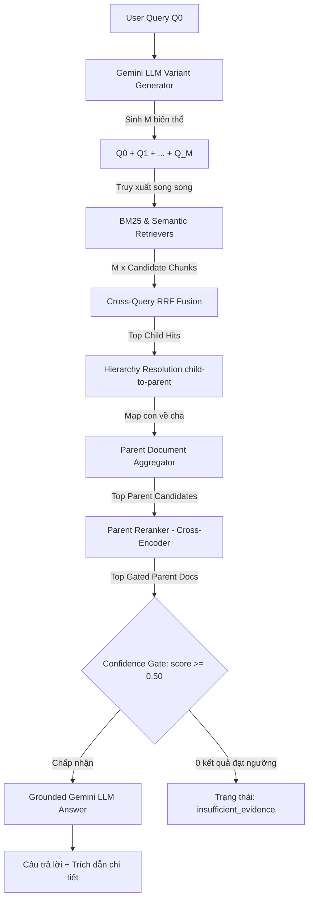

# 🌲 Hệ Thống Hierarchical RAG & Multi-Query Retrieval - Buổi 09

Tài liệu này hướng dẫn chi tiết về kiến trúc, cách thiết lập cấu hình, các công thức toán học và quy trình thực thi hệ thống **Hierarchical RAG & Multi-Query Retrieval (Buổi 09)**.

---

## 🎯 1. Mục Tiêu và Khác Biệt Buổi 08 vs Buổi 09
- **Buổi 08 (Advanced RAG)**: Thực hiện tìm kiếm phẳng (Flat Search) trực tiếp trên các chunk con (Clause / Point) và xếp hạng lại bằng Cross-Encoder trước khi gửi LLM. Hạn chế lớn là LLM bị thiếu ngữ cảnh toàn diện của Điều luật cha, dẫn đến việc trả lời bị cắt vụn hoặc thiếu tính liên kết.
- **Buổi 09 (Hierarchical RAG)**: Nâng cấp luồng xử lý thông qua hai kỹ thuật:
  1. **Multi-Query Expansion**: Sinh các câu hỏi biến thể từ câu hỏi gốc của người dùng nhằm tăng độ phủ từ khóa và khía cạnh pháp lý.
  2. **Hierarchy Resolution & Parent Aggregation**: Định vị các chunks con có độ tương thích cao, ánh xạ ngược về tài liệu cha tương ứng (Article / Chương), gộp ngữ cảnh các con trong cùng một cửa sổ cha, tiến hành Rerank cấp độ cha, rồi mới gửi LLM để sinh câu trả lời có tính kiểm chứng và trích dẫn chuẩn xác.

---

## 🏗️ 2. Sơ Đồ Pipeline Hai Tầng Fusion và Parent Expansion


---

## 🎛️ 3. Bốn Chế Độ Thực Thi (Mode Comparison)
Hệ thống hỗ trợ cấu hình linh hoạt qua 4 chế độ:
1. **`single_flat`**: Truy xuất phẳng cơ bản (1 query $Q_0 \to$ RRF $\to$ Rerank $\to$ Gen). Giống Buổi 08.
2. **`multi_flat`**: Truy xuất phẳng mở rộng (M queries $\to$ Cross-query RRF $\to$ Rerank $\to$ Gen).
3. **`single_parent`**: Truy xuất phân cấp đơn câu hỏi (1 query $Q_0 \to$ RRF child $\to$ Map to Parent $\to$ Aggregate $\to$ Rerank parent $\to$ Gen).
4. **`multi_parent`** (Mặc định): Truy xuất phân cấp đa câu hỏi (M queries $\to$ Cross-query RRF child $\to$ Map to Parent $\to$ Aggregate $\to$ Rerank parent $\to$ Gen).

---

## 📂 4. Cấu Trúc Dự Án và Thiết Lập File `.env`

### Cấu Trúc Dự Án:
```text
rag_advanced/buoi_09/
├── SPEC_buoi_09.md          # Đặc tả thiết kế chi tiết Buổi 09
├── README.md                # Tài liệu hướng dẫn sử dụng & audit
├── requirements.txt         # Danh sách thư viện phụ thuộc
├── .env.example             # Template cấu hình mẫu
├── rag.py                   # Module RAG Baseline từ Buổi 08
├── advanced_rag.py          # Xử lý Reranker & Hybrid từ Buổi 08
├── hierarchical_rag.py      # Xử lý phân cấp, Multi-query và RRF
├── ui_helpers.py            # Hàm thuần Python format hiển thị UI
├── evaluate.py              # Đánh giá chất lượng RAG (Recall, nDCG, MRR)
├── app.py                   # Giao diện Streamlit Dashboard chính
├── eval/
│   └── questions.json       # Bộ câu hỏi kiểm thử gold labels
├── reports/
│   └── latest_report.json   # Kết quả đánh giá gần nhất
└── tests/
    ├── test_ui_helpers.py   # Test UI helper offline
    ├── test_evaluator.py    # Test đánh giá offline
    └── test_query_flow.py   # Test luồng truy vấn
```

### Thiết Lập File `.env` (`rag_advanced/buoi_09/.env`):
```ini
# Gemini API Key
GEMINI_API_KEY=YOUR_GEMINI_API_KEY_HERE

# Models Configuration
GEMINI_EMBEDDING_MODEL=gemini-embedding-2
GEMINI_GENERATION_MODEL=gemini-3.5-flash-lite
RERANKER_MODEL=BAAI/bge-reranker-v2-m3

# Multi-Query Parameters
MULTI_QUERY_COUNT=3
MULTI_QUERY_MAX_CHARS=300
MULTI_QUERY_TEMPERATURE=0.2
MULTI_QUERY_ORIGINAL_WEIGHT=1.5
MULTI_QUERY_VARIANT_WEIGHT=1.0
MULTI_QUERY_RRF_K=60

# Candidate Limits
BM25_CANDIDATES=20
SEMANTIC_CANDIDATES=20
RERANK_CANDIDATES=20
PER_QUERY_CANDIDATES=12
PARENT_CANDIDATES=10
FINAL_PARENT_TOP_K=3

# Parent Windowing & Budget
PARENT_MAX_CHARS=6000
PARENT_SCORE_CHILD_LIMIT=3
TOTAL_CONTEXT_MAX_CHARS=16000
RERANK_MIN_SCORE=0.5
FINAL_TOP_K=3

# Strategy
STRATEGY=hierarchical
```

---

## ⚙️ 5. Build Hierarchy và Giải Thích Warning & Ambiguous

### Quy Trình Xây Dựng Registry Phân Cấp:
1. Đọc tất cả các chunks của strategy `hierarchical` từ thư mục chunks của Buổi 05.
2. Sắp xếp các chunks theo thứ tự số tăng dần của `chunk_id`.
3. Phân giải phân cấp (Hierarchy Resolution) bằng cách ưu tiên:
   - Metadata structure của chính chunk đó.
   - Nhận diện tiêu đề Điều/Chương từ dòng đầu của văn bản (Regex `Điều \d+`).
   - Kéo theo (carry forward) từ chunk liền trước của cùng văn bản nguồn.
   - Fallback về văn bản mặc định (`DOCUMENT_FALLBACK`).

### Giải Thích Cảnh Báo (Warnings & Ambiguous):
- **Conflict Ambiguous Warning**: Xảy ra khi có sự mâu thuẫn giữa metadata cấu trúc của chunk và heading thực tế trong văn bản. Ví dụ: Metadata ghi `Điều 2` nhưng văn bản chứa `Điều 8`. Chunk sẽ được gán `ambiguous = True` kèm mô tả chi tiết lỗi.
- **Oversized Single Child**: Cảnh báo khi một chunk con đơn lẻ có độ dài lớn hơn `PARENT_MAX_CHARS`. Chunk con vẫn được giữ lại nhưng được dán nhãn cảnh báo.
- **First Parent Oversized Context Limit**: Xảy ra khi tài liệu cha đầu tiên vượt quá giới hạn ngữ cảnh tối đa, hệ thống vẫn phải giữ lại để tránh mất mát thông tin.

---

## 💰 6. Query Expansion Contract và API Call Budget
- **Deduplication**: Các câu hỏi biến thể được NFC normalized, casefold và dọn dẹp khoảng trắng trước khi so khớp loại trùng.
- **Safety check**: Nghiêm cấm tự chế số hiệu Điều/Khoản luật mới. Các biến thể chứa Điều/Khoản không có trong câu hỏi gốc sẽ bị lọc bỏ.
- **Gemini generation API call budget**: Luôn giữ cuộc gọi sinh biến thể tối đa là 1 lần trên mỗi câu hỏi gốc. Sử dụng caching trong phiên làm việc để tránh gọi lại nhiều lần trên cùng một câu hỏi.

---

## 🧮 7. Công Thức Inner RRF, Cross-Query RRF và Parent Aggregation

### A. Công thức Cross-Query RRF (RRF chéo giữa các câu hỏi):
Với $M$ câu hỏi biến thể, điểm RRF của một child chunk $c$ được gộp từ thứ hạng của nó trên tất cả các danh sách tìm kiếm:
$$RRF(c) = \sum_{q \in Q} \frac{w_q}{RRF\_K + Rank_q(c)}$$
Trong đó:
- $w_{original} = \text{MULTI\_QUERY\_ORIGINAL\_WEIGHT}$ (Ví dụ: `1.5`)
- $w_{variant} = \text{MULTI\_QUERY\_VARIANT\_WEIGHT}$ (Ví dụ: `1.0`)
- $Rank_q(c)$ là thứ hạng của chunk $c$ trong kết quả tìm kiếm của câu hỏi $q$.

### B. Công thức Gom Điểm Parent (Parent Aggregation):
Điểm số sơ bộ của Parent Document trước Rerank được tính bằng tổng điểm các con đóng góp:
$$Score(P) = \sum_{c \in Child(P)} RRF(c)$$
Để tránh thiên lệch đối với các Điều dài chứa quá nhiều node con nhỏ, chỉ tính tổng của tối đa $K_{limit} = \text{PARENT\_SCORE\_CHILD\_LIMIT}$ con có điểm cao nhất.

---

## 🔍 8. Child Retrieval, Parent Return, và Rerank Parent
- Hệ thống thực hiện tìm kiếm hybrid (BM25 + Semantic) trên các child chunks để tận dụng độ phủ từ khóa và ngữ nghĩa.
- Sau khi tìm được danh sách chunks con đạt điểm RRF chéo cao nhất, hệ thống thực hiện gom nhóm và lấy ra tài liệu cha (Parent Documents) tương ứng chứa chúng.
- Bước **Rerank** (Cross-Encoder) được áp dụng trực tiếp trên tài liệu cha (chứ không phải chunks con) để chọn lọc ra các tài liệu cha chất lượng nhất trước khi gửi LLM.

---

## ⌨️ 9. Các Lệnh Điều Khiển và Streamlit (CLI & App)

Chạy các lệnh bằng môi trường ảo `.venv`:

- **Kiểm tra trạng thái index:**
  ```powershell
  D:\Rag_thuchanh\RAG\rag_foundation\buoi_05\.venv\Scripts\python.exe hierarchical_rag.py hierarchy-status
  ```
- **Xây dựng Hierarchy Registry:**
  ```powershell
  D:\Rag_thuchanh\RAG\rag_foundation\buoi_05\.venv\Scripts\python.exe hierarchical_rag.py build-hierarchy
  ```
- **Thử nghiệm sinh Multi-query:**
  ```powershell
  D:\Rag_thuchanh\RAG\rag_foundation\buoi_05\.venv\Scripts\python.exe hierarchical_rag.py expand-query --question "Quy định cho vay?"
  ```
- **Truy xuất Chunks con hỗ trợ:**
  ```powershell
  D:\Rag_thuchanh\RAG\rag_foundation\buoi_05\.venv\Scripts\python.exe hierarchical_rag.py multi-child --question "Quy định cho vay?"
  ```
- **Truy xuất Tài liệu cha:**
  ```powershell
  D:\Rag_thuchanh\RAG\rag_foundation\buoi_05\.venv\Scripts\python.exe hierarchical_rag.py parent-retrieve --question "Quy định cho vay?" --mode multi_parent
  ```
- **Chạy RAG đầy đủ:**
  ```powershell
  D:\Rag_thuchanh\RAG\rag_foundation\buoi_05\.venv\Scripts\python.exe hierarchical_rag.py query --question "Quy định cho vay?" --mode multi_parent
  ```
- **So sánh 4 chế độ trên terminal:**
  ```powershell
  D:\Rag_thuchanh\RAG\rag_foundation\buoi_05\.venv\Scripts\python.exe hierarchical_rag.py compare --question "Quy định cho vay?"
  ```
- **Chạy Đánh giá (Benchmark Offline):**
  ```powershell
  D:\Rag_thuchanh\RAG\rag_foundation\buoi_05\.venv\Scripts\python.exe evaluate.py --k 3
  ```
- **Khởi chạy ứng dụng Streamlit Dashboard:**
  ```powershell
  D:\Rag_thuchanh\RAG\rag_foundation\buoi_05\.venv\Scripts\python.exe -m streamlit run app.py
  ```

---

## ⏱️ 10. Giải Thích Candidate K, Parent K, và Context Budget
- **Candidate K (`BM25_CANDIDATES` & `SEMANTIC_CANDIDATES`)**: Số lượng chunks tối đa lấy ra từ bước tìm kiếm thô.
- **Parent Candidates (`PARENT_CANDIDATES`)**: Số lượng tài liệu cha tối đa được thu thập để xếp hạng lại bằng Cross-Encoder.
- **Final Top K (`FINAL_PARENT_TOP_K`)**: Số lượng tài liệu cha tối đa được chấp nhận để đưa vào prompt gửi LLM.
- **Context Budget (`TOTAL_CONTEXT_MAX_CHARS`)**: Giới hạn tổng ký tự của tất cả các tài liệu cha được gửi trong prompt để tránh việc LLM bị quá tải hoặc phản hồi chậm.

---

## 📈 11. Các Chỉ Số Đánh Giá (Evaluation Metrics)
1. **Child Recall@K**: Đo lường tỉ lệ chunks con chuẩn xác nằm trong danh sách chunks đóng góp của tài liệu cha được truy xuất.
2. **Parent Recall@K**: Đo lường tỉ lệ tài liệu cha chuẩn xác được truy xuất.
3. **MRR@K (Mean Reciprocal Rank)**: Thứ hạng nghịch đảo trung bình của chunk con chuẩn đầu tiên tìm thấy.
4. **nDCG@K**: Điểm số tích lũy giảm dần chuẩn hóa, phản ánh độ chính xác và vị trí ưu tiên của kết quả.

*Giới hạn tập câu hỏi chuẩn (Gold labels):* Do tập dữ liệu kiểm thử chứa các cờ `needs_human_review=true`, kết quả benchmark offline chỉ mang tính tham khảo kỹ thuật và không dùng để tuyên bố chế độ tối ưu nhất khi chưa có sự duyệt lại thủ công của con người.

---

## 🔧 12. Hướng Dẫn Khắc Phục Sự Cố (Troubleshooting)
- **Hierarchy Store Stale**: Xảy ra khi cấu hình `PARENT_MAX_CHARS` trong `.env` bị thay đổi so với registry đã build trên đĩa. Khắc phục: Nhấp chọn checkbox xác nhận và nhấn nút **Build Hierarchy Registry** trên giao diện Streamlit để tái lập.
- **Reranker hoặc API lỗi**: Kiểm tra lại GEMINI_API_KEY trong tệp cấu hình hoặc kết nối Internet. Đối với Reranker, kiểm tra xem đã cài đặt đầy đủ các thư viện trong `requirements.txt` hay chưa.
- **Latency lớn**: Các chế độ mở rộng (`multi_parent`, `multi_flat`) cần chạy song song $M$ lần truy xuất. Có thể tăng tốc bằng cách điều chỉnh giảm số lượng `MULTI_QUERY_COUNT` hoặc cấu hình GPU cho Reranker.

---

## ⚖️ 13. Tuyên Bố Miễn Trừ Trách Nhiệm Pháp Lý
> [!CAUTION]
> Hệ thống này được xây dựng cho mục đích thử nghiệm và học tập công nghệ thông tin. Các câu trả lời và trích dẫn được sinh ra bởi trí tuệ nhân tạo không cấu thành và không được hiểu là ý kiến tư vấn pháp lý chính thức từ cơ quan nhà nước hay chuyên gia luật. Người sử dụng cần tra cứu và đối chiếu văn bản quy phạm pháp luật gốc trên công báo quốc gia trước khi áp dụng vào thực tế kinh doanh.
