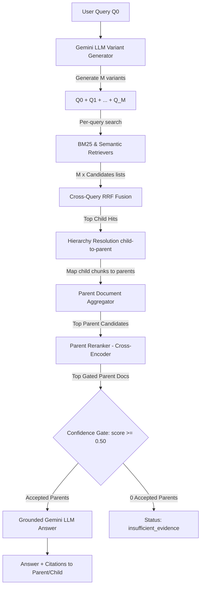

# SPECIFICATION - BUỔI 09: HIERARCHICAL RAG & MULTI-QUERY RETRIEVAL

---

## 🎯 1. Mục tiêu và Khác biệt Buổi 08 vs Buổi 09

* **Buổi 08 (Advanced RAG)**: Truy xuất phẳng (Flat Search) bằng cách lấy trực tiếp các candidate chunks từ cơ sở dữ liệu và chuyển tiếp cho Cross-Encoder Reranker chấm điểm và chuyển LLM.
* **Buổi 09 (Hierarchical RAG)**: Nâng cấp luồng xử lý qua hai kỹ thuật chính:
  1. **Multi-Query Expansion**: Sinh ra $M$ câu hỏi biến thể để khắc phục hạn chế từ khóa của người dùng.
  2. **Hierarchy Resolution & Parent Aggregation**: Định vị các node con (Clause, Point) khớp với câu hỏi, sau đó truy ngược lên để tổng hợp ngữ cảnh ở cấp độ cha (Article / Chương). Sau đó, tiến hành Rerank cấp độ cha trước khi đưa vào LLM sinh câu trả lời grounded.

---

## 🏗️ 2. Sơ đồ Luồng Hoạt động (Pipeline Flow)



---

## 🎛️ 3. Bốn Chế độ Thực thi (Modes)

Hệ thống bắt buộc hỗ trợ đúng 4 modes sau đây:

1. **`single_flat`**: Chế độ truy xuất phẳng cơ bản (1 query $Q_0 \to$ RRF $\to$ Rerank $\to$ Gen). Giống Buổi 08.
2. **`multi_flat`**: Truy xuất phẳng mở rộng (M queries $\to$ Cross-query RRF $\to$ Rerank $\to$ Gen).
3. **`single_parent`**: Truy xuất phân cấp đơn câu hỏi (1 query $Q_0 \to$ RRF child $\to$ Map to Parent $\to$ Aggregate $\to$ Rerank parent $\to$ Gen).
4. **`multi_parent`** (Default): Truy xuất phân cấp đa câu hỏi (M queries $\to$ Cross-query RRF child $\to$ Map to Parent $\to$ Aggregate $\to$ Rerank parent $\to$ Gen).

---

## 📋 4. Các Định dạng Dữ liệu & Schemas

### A. QueryVariant Schema
```json
{
  "original_query": "Điều 7 quy định gì?",
  "variants": [
    "Cơ cấu lại thời hạn trả nợ theo Điều 7 quy định như thế nào?",
    "Điều kiện gia hạn nợ quy định tại Điều 7 ra sao?"
  ]
}
```

### B. Hierarchy Registry Schema
Registry được lưu trữ dạng từ điển tham chiếu ngược từ child chunk sang parent info:
```json
{
  "child_chunk_id": {
    "parent_article": "Điều 2. Đối tượng áp dụng",
    "parent_chapter": "Chương I",
    "source": "TT_02_2023_NHNN.pdf",
    "hierarchy_depth": 3
  }
}
```

### C. ParentDocument Schema
Tài liệu cha tổng hợp được định nghĩa dưới dạng cấu trúc sau:
```json
{
  "parent_id": "TT_02_2023_NHNN.pdf::Điều 2. Đối tượng áp dụng",
  "source": "TT_02_2023_NHNN.pdf",
  "heading": "Điều 2. Đối tượng áp dụng",
  "chapter": "Chương I",
  "aggregated_text": "[Điều 2. Đối tượng áp dụng] ... [Khoản 1] ... [Khoản 2] ...",
  "child_chunk_ids": ["chk_001", "chk_002"],
  "child_scores": {
    "chk_001": 0.0322,
    "chk_002": 0.0150
  }
}
```

### D. MultiQueryChildHit Schema
```json
{
  "chunk_id": "chk_001",
  "rrf_score": 0.0452,
  "matched_by_queries": ["Q0", "Q1"]
}
```

### E. ParentCandidate Schema
```json
{
  "parent_id": "TT_02_2023_NHNN.pdf::Điều 2. Đối tượng áp dụng",
  "aggregated_score": 0.0520,
  "rerank_score": 0.8542,
  "accepted": true
}
```

---

## ⚙️ 5. Quy tắc Hierarchy Resolution & Ambiguous Warning

> [!CAUTION]
> **Rủi ro lớn**: Không thể chỉ dùng trường `structure.article` hoặc `structure.chapter` để gom nhóm các con dưới cùng một Điều/Chương. `TT_06` và `TT_39` hoàn toàn không chứa các khóa này trong metadata.

### Quy tắc phân giải phân cấp (Hierarchy Resolution):
1. **Fallback sang Text Regex**: Nếu metadata `structure` bị thiếu `article` hoặc `chapter`, hệ thống bắt buộc phải quét ngược lại các chunk trước đó có chung `source` để tìm tiêu đề Điều/Chương gần nhất. Hoặc dùng regex lọc mẫu `"Điều \d+"` đầu dòng văn bản để tự động gán nhãn cha.
2. **Ambiguous Warning**: Nếu phát hiện một câu văn chứa nhiều từ khóa Điều luật (ví dụ: *"Tổ chức tín dụng thực hiện trích lập dự phòng theo quy định tại Điều 5 và Điều 6"*), hệ thống phải phát cảnh báo `ambiguous_parent_resolved` vào danh sách `warnings`, gán chunk cho Điều cha thực sự thay vì các điều tham chiếu.

---

## 🧮 6. Công thức RRF Đa Câu Hỏi & Gom Điểm Parent

### A. Công thức Cross-Query RRF:
Với $M$ câu hỏi biến thể, điểm RRF của một child chunk $c$ được tính tổng hợp thứ hạng từ tất cả các danh sách tìm kiếm:
$$RRF(c) = \sum_{q \in Q} \frac{w_q}{RRF\_K + Rank_q(c)}$$
Trong đó:
* $w_{original} = \text{MULTI\_QUERY\_ORIGINAL\_WEIGHT}$ (Ví dụ: `1.5`)
* $w_{variant} = \text{MULTI\_QUERY\_VARIANT\_WEIGHT}$ (Ví dụ: `1.0`)

### B. Công thức Gom Điểm Parent (Parent Aggregation):
Điểm số sơ bộ của Parent Document trước Reranking được tổng hợp từ điểm các con:
$$Score(P) = \sum_{c \in Child(P)} RRF(c)$$
Để tránh thiên vị các Điều có quá nhiều node con nhỏ, chỉ tính tổng của tối đa $K_{limit} = \text{PARENT\_SCORE\_CHILD\_LIMIT}$ con có điểm cao nhất.

---

## 💰 7. Context Budget & Citation Contract

### A. Context Budget:
* **`PARENT_MAX_CHARS` (6000)**: Giới hạn độ dài text của một parent document.
* **`TOTAL_CONTEXT_MAX_CHARS` (16000)**: Tổng độ dài text tối đa đưa vào prompt grounding để tránh tràn cửa sổ LLM.

### B. Citation Contract:
LLM sinh câu trả lời chứa nhãn trích dẫn dạng `[P1]`, `[P2]` tương ứng với Parent Document. Hệ thống tự động phân giải nhãn sang metadata thực tế của cả Parent (Điều, Chương) lẫn các Child chunks đóng góp cấu thành nên parent đó.

---

## ⚠️ 8. Status & Failure Contract

Hệ thống trả về các trạng thái tiêu chuẩn sau:
* **`answered`**: Trả lời thành công dựa trên bằng chứng hợp lệ.
* **`insufficient_evidence`**: Không có parent candidate nào vượt qua Rerank Gate (`>= RERANK_MIN_SCORE`).
* **`retrieval_only`**: Lỗi hoặc rỗng khi gọi LLM generation.
* **`reranker_unavailable`**: Reranker model bị lỗi hoặc không khả dụng.

---

## 🧪 9. Kiểm thử (Testability & DI)

Mọi hàm xử lý chính như `query_hierarchical_rag` và `run_evaluation` phải chấp nhận Dependency Injection (qua tham số `custom_generator`, `custom_reranker`, `custom_bm25_retriever`, `custom_semantic_retriever`) để cho phép chạy unittest 100% offline mà không phụ thuộc vào internet hoặc mô hình thật.

---

## 📈 10. Chỉ số Đánh giá Metrics

Đánh giá Benchmark Offline của Buổi 09 tính toán chéo 4 chỉ số chất lượng:
* **Recall@K**
* **MRR@K**
* **nDCG@K**
* **Latency (Mean, P50)**

Nếu tập câu hỏi chứa `needs_human_review=true`, hệ thống sẽ cảnh báo và không tuyên bố mode chiến thắng chính thức.

---

*Xác nhận: Specification này chỉ được áp dụng và lưu trong thư mục `rag_advanced/buoi_09/`.*
